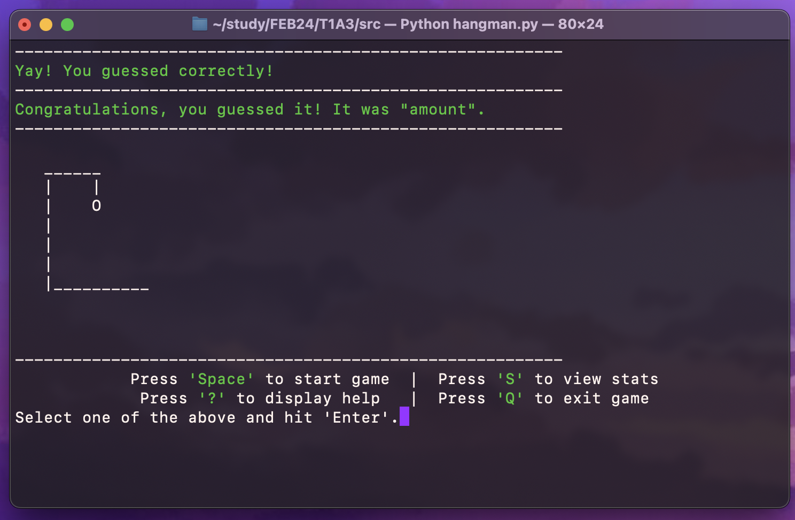

# T1A3 - Terminal Application Assignment
## Kate Gerber's Text-Based Word Guessing Game/Hangman

### R3. Referenced Sources

Sources Links

- [Hangman image](https://www.google.com/search?sca_esv=f807be754d1cd3a2&q=hangman&tbm=isch&source=lnms&sa=X&sqi=2&ved=2ahUKEwih9L3pmuiFAxV1T2wGHUMWBMQQ0pQJegQICRAB&biw=1248&bih=662&dpr=2#imgrc=ecE6rYqZmYlRfM)
- [Image to ASCII Art converter](https://www.asciiart.eu/image-to-ascii?fbclid=IwZXh0bgNhZW0CMTAAAR08yyg_svulntnc3UI1XGw2Wuea9jSeOVbfEflhgXi45hgDOFl291kq2kU_aem_AYbxnqkTaRass8EeeWkuXmK7GzCK-6BE5pAZXviP1cAcJ4KOZkJbZhByOkrExaD7ADyerPMrMyRvi4z_Nrka2rEt)
- [Strip code](https://www.w3schools.com/python/ref_string_strip.asp)
- [wonderwords](https://pypi.org/project/wonderwords/)
- [Pytest](https://semaphoreci.com/community/tutorials/testing-python-applications-with-pytest?fbclid=IwZXh0bgNhZW0CMTAAAR0R5irQ4ivfQU9jiogdVaP1VLqV8zg-dSEs9-kYAQsykKWJ6BQYcn16IJo_aem_AYbatc_krk9xhKD0S8a02RKU8GCWbZlcF2zQ0kljdqGmdtt0QFVlcm85t2tK5oYdz2QvPmBrRlCDBfIQq7VcJjuX)
- [Rich](https://github.com/Textualize/rich)
- [Colored](https://dslackw.gitlab.io/colored/)

## R4. GitHub Repository Link
- [GitHub T1A3 App Link](https://github.com/k8-g/T1A3-App)

## R5. Code Style
[PEP8 Style](https://peps.python.org/pep-0008/)
- snake_case used for majority of code
- Camel_case used for Classes
- Comments capitilised with one space between # and comment
- """ on new line at end (`hangman_screens.py`)

## R6. Develop a list of features that will be included in the application. 

### Main features of the app:
- Main menu & it's executable options
    - 'Start game', 'View stats', 'Display Help', 'Quit game'
- 'View stats' page; shows saved wins & losses count
- 'Hangman Help' page; basic user how-to-play text tutorial
- The game itself; 
    - Displays empty Hangman gallows (with no body)
    - Loads a randomly generated word from wonderwords
    - Converts the randomly generated word into a blanked "hidden" word
    - Prompts the user to guess a letter
    - Loops through all letters in randomly generated word
    - Checks if user's guess is correct, displays correct guess message 
    - Checks if user's guess is incorrect, displays incorrect guess message
    - Saves what letters user has guessed in hidden '_guess' list
    - Updates Hangman drawing if incorrect, adding a body part each time
    - Checks if game is over (incorrect guess count = 6)
    - Displays Win or Lose message
    - Saves every win & loss to 'View Stats' page
    - Quit game while playing, doesn't save game as win or loss
    - Screen flashes if user loses game
- Quit program

#### Error Handling:

    - if user inputs anything other than options shown in menu
    - if user inputs uppercase letters
    - if user inputs more than one character while guessing
    - if user inputs any spaces while guessing

#### File Handling:
- Saves wins and losses in stats.csv  file
- Loads wins and losses to 'View Stats' page
___
### Main Menu: 

The main menu screen loads at the beginning of the program. It shows a 'Hangman' ACSII text image, a blinking 'WELCOME TO HANGMAN!' message, and lists the following options. The program waits for the user to input their selection.

    "Press 'Space' to start game"
    "Press 'S' to view stats"
    "Press '?' to display help"
    "Press 'Q' to exit game"
    Select one of the above and hit 'Enter'.

Screenshot of main menu
 

 

The main menu is created using a display menu function (`create_menu` in `hangman_functions.py`) and the user input menu function (see `hangman.py`). 

    def create_menu():
        console.print("Press 'Space' to start game  |  Press 'S' to view     stats",justify="center") 
        console.print("Press '?' to display help   |  Press 'Q' to exit game",justify="center") 
 
        menu_selection = input("Select one of the above and hit 'Enter'.")
        return menu_selection.lower()

If the user inputs their option in uppercase, there is an error handling code that converts their input into lowercase, so the program won't break and will continue as normal (`return menu_selection.lower()` in `create_menu` function in `hangman_functions.py`).

I created a while loop (shown below), which essentially says, "while the user's selection isn't equal to 'q'; if it's space, play the game. If it's 's', display the stats, if it's '?', display the help page, if it is 'q', it prints 'bye!' and quits the program. Else/otherwise, if the user inputs anything other than the above options, the program gives an error handling warning message asking the user to "Please select one of the four options displayed" and hit 'Enter'." (Please see actual code for comments as well).

    while user_selection != "q":
        user_selection = create_menu()
        if (user_selection == " "):
            print("Start game!")
            play_game()
        elif (user_selection == "s"):
            display_stats()
        elif (user_selection == "?"):
            display_help()
        elif (user_selection == "q"):
            print("Bye!")
        else:
            display_intro()
            print(f"{Fore.magenta}Please select one of the four options displayed.{Style.reset}")
    print("Good Game!")

Screenshot of "Please select one of the four options displayed" error handling message
 

 

___
### Playing the game:

After the player presses 'Spacebar' + 'Enter', the game starts. A random word is generated using the [wonderwords package](https://pypi.org/project/wonderwords/), which is then displayed as a blanked out word, showing the hidden letters as underscores, for example, the word 'feline' would be displayed as '_ _ _ _ _ _'. An empty 'Hangman' gallows text image is displayed as well.

Screenshot of start of game
 
(This first hangman drawing displayed is hangman_image_0 from hangman_screens.py)

 

Two functions operate to start the game; `play_game` in `hangman_functions.py` (shown below) & `start_game` in `Game.py`. 

    def play_game():
        clear_screen()
        my_game = Game(stats)
        my_game.start_game()
        stats.save_stats()

The first clears the screen and loads the game (and any stats if there any saved), whilst the second (shown below) draws the empty gallows display (`draw_hangman`), generates the random word to be guessed (`self._hangman_word = self.generate_word()`) and replaces the letters in the words to be displayed as underscores with spaces beside them to seperate them. (`print("_ "*len(self._hangman_word))`)

    def start_game(self):
            self.draw_hangman() 
            self._hangman_word = self.generate_word()
            print("_ "*len(self._hangman_word))
            while self._game_over == False:
                print(self._blanked_word)
                user_guess = input ("Try guessing a letter.\n").lower().strip()
                os.system("clear")
                if len(user_guess) == 1:
                    if user_guess == "!":
                        self._game_over = True
                        console.print("[bold] GAME ENDED [/bold]")
                    else:
                        self.check_user_guess(user_guess)  
                else:
                    self.line_break()
                    print(f"{Fore.magenta}Please only select one letter.{Style.reset}")
                    self.line_break()
                self.check_letters()
                self.draw_hangman()
            self.line_break()

While the game is not over (`while self._game_over == False:` in `start_game` function in `Game.py`), the game prints the blanked out word and asks for input. 

There are also two built-in Python string functions that converts the user input into lowercase and stips any accidental or excess spaces, so that the game will function as normal even if the input is uppercase or if the user inputs any spaces. 

    user_guess = input ("Try guessing a letter.\n").lower().strip() 

It clears the screen of the previous messages once inputted. Then it checks if the input is one character length only (`if len(user_guess) == 1:`), which if it isn't, it prints an error handling message asking the user to only input one letter (because more than one character length isn't what we want).

Screenshot of "Please only select one letter" error handling message
 

 

 If the user input is '!', there is a function that ends the game.

    if user_guess == "!":
        self._game_over = True

Screenshot of "Game Ended" message
 

 

Else turn continues as normal.

When player has input a letter followed by the 'Enter' key, the game will let the player know if their guess is in the word or an incorrect guess. It does this by running a `check_letters` function (in `Game.py`, see code snippet below) which checks if the inputted letter is in the word.  

It starts a loop that iterates over each letter in the `_hangman_word` which is the word that player needs to guess, and it compares each letter in the word with the letters you've already guessed (which is stored in a hidden `_guesses` list).

    def check_letters(self):
        word_guessed = True
        self._blanked_word = ""
        for letter in self._hangman_word:
            if letter in self._guesses:
                self._blanked_word += letter
            else:
                self._blanked_word += "_"
                word_guessed = False
            self._blanked_word += " "
        if word_guessed == True:
            self.win_game()

If the player guesses incorrectly (i.e. the letter is not in the hangman word), a message displays saying that the letter guessed is not in the word and the 'Hangman' ASCII image will be updated to reflect the next stage of the hanged man. A function will also add a count to the incorrect guesses count. 
 

Screenshot of incorrect guess
 
feat. hangman_image_2

 

If the player guesses a letter correctly, that letter is then converted from the corresponding underscore into the guessed letter in the displayed blanked word. A message will also be displayed telling the player that the letter they have guessed is correct. They then can guess again.

Screenshot of correct guess
 
feat. hangman_image_1

 

Code block for incorrect & correct guess messages + incorrect count:

    if _guess not in self._hangman_word:
        self._incorrect += 1
        print(f"{Fore.red}Sorry, {_guess} isn't in this word.{Style.reset}")
        if self._incorrect == 6:
        self.lose_game()
    else:
        print(f"{Fore.green}Yay! You guessed correctly!{Style.reset}")  

The game records the letters guessed to a local `_guess` file, so it "remembers" what the user has already guessed. This is used in the code for when the user inputs a letter that they've already inputted before.

When this happens, a message is displayed letting the user know that they've already guessed that letter, and the game will treat that guess as a turn, penalising the user if it's incorrect. 

The following code says if the user's guess is in the guess list, it'll print the you've already guessed message.

    if _guess in self._guesses: print(f"{Fore.magenta}You've already guessed {_guess}.{Style.reset}")

Screenshot of "You've already guessed {_guess}."
 
feat. hangman_image_5

 

The player can continue guessing until either they have guessed all the hidden letters, or until the Hangman drawing is complete, which is 6 incorrect guesses count.

In between all these turns, a function is called from the OS to clear the screen. 

    def clear_screen():
        os.system("clear")

Which is called using `clear screen()`.

Once the player has guessed all the letters, a `win_game` function runs (see code below), which prints the win message and it adds your win to the wins stats count, which can be viewed on the 'View Stats' page, once you have played a game to completion.

    def win_game(self):
        self._game_over = True
        print(f"{Fore.green}Congratulations, you guessed it! It was \"{self._hangman_word}\".{Style.reset}")
        self.line_break()
        self._stats.add_win()

Screenshot of winning the game
 

 

If the user fails to guess before the 'Hangman' drawing is completed, the game ends. There is a function that checks if the game is over by checking the incorrect guesses count, which once it reaches 6 (which is also the amount of hangman drawing stages), it ends the game, prints a "GAME OVER!" message, and a terminal bell/screen flash occurs. It also saves your game as a loss count, which can then be viewed in the 'View Stats' page.

Screenshot of losing the game
 
feat. hangman_image_6

 

The user can exit the game at any point by pressing '!' + 'Enter'. Exiting the game doesn't save anything to the 'View Stats' page and the player can choose again from the main menu.

### View Stats

Screenshot of view stats
 

 

Pressing 'S' + 'Enter' takes you to a 'View Stats' page, where the user is able to see the wins and losses of every time they've played. The outcome of the game is saved after every game via file handling and is viewable in the 'View Stats' page. 

If the player exits the program and reruns the program, they can see the previous stats in the 'View Stats' page.

### Help page

Screenshot of Hangman Help
 

 

Pressing '?' + 'Enter' takes the user to a help display page, where they can find a basic how-to-play the game explaination (HELP.md file).

### Quit Game

Screenshot of quit game
 

 

Pressing 'Q' + 'Enter' quits the program altogether.

## R7. Implementation Plan
[Trello Board](https://trello.com/invite/b/2KkDIwnm/ATTI8c7dcc244337075ee0527f62c31d103895FB879E/t1a3-terminal-application-assignment-checklist)

## R8. Help Documentation

See [Help Documentation.md](docs/Help%20Documentation.md) for how to install and use app

#### Packages used:
- [Colored](https://pypi.org/project/colored/)
    - Allows colours in program

- [Rich](https://github.com/Textualize/rich)
    - Allows rich text formatting in HELP.md
    - Centers text in code

- [WonderWords](https://pypi.org/project/wonderwords/)
    - Generates random word for game

- OS (built-in Python module)
    - clear screen function
    - file handling

- [Pytest](https://docs.pytest.org/en/stable/)
    - Error handling
    - Testing

